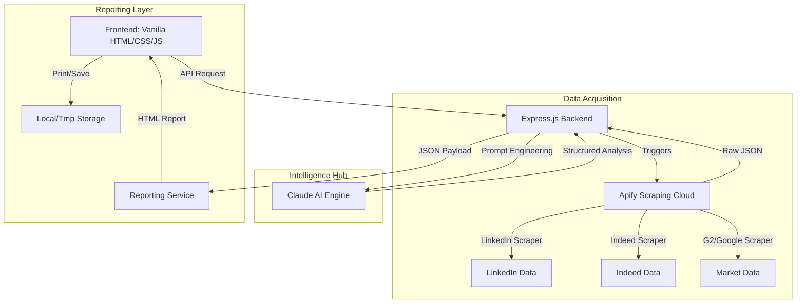

Access your live here -->You can only access live functionality through APIs. To enable it, clone the required service and configure it by adding the necessary API keys in your environment variables.  
https://JobifyAI.replit.app

# Jobify & ReWire Intelligence Suite 

[](https://nodejs.org/)
[](https://www.anthropic.com/)
[](https://opensource.org/licenses/ISC)
[](https://expressjs.com/)

> **The next-generation intelligence platform for Career matching, Market research, and Strategic planning.**

##  Demo Overview

> **Live Platform**: Run locally at `http://localhost:3000` after setup (see below).

### Application Flow

| Step | Action | Result |
|:---:|:---|:---|
| 1️ | Upload or paste your résumé | AI parses your skills & experience |
| 2️ | Set job title, location, sources | Apify scrapes Indeed & LinkedIn live |
| 3️ | Click ** ANALYZE JOBS** | Claude AI ranks every match 0–100% |
| 4️ | View ranked results table | Skill gaps, matched skills, salary ranges |
| 5️ | Click **↗ OPEN REPORT** | Full HTML report with all insights |

---
𝘑𝘰𝘣𝘪𝘧𝘺 𝘪𝘴 𝘢 𝘩𝘪𝘨𝘩-𝘦𝘯𝘥 𝘢𝘶𝘵𝘰𝘮𝘢𝘵𝘪𝘰𝘯 𝘴𝘶𝘪𝘵𝘦 𝘵𝘩𝘢𝘵 𝘣𝘳𝘪𝘥𝘨𝘦𝘴 𝘵𝘩𝘦 𝘨𝘢𝘱 𝘣𝘦𝘵𝘸𝘦𝘦𝘯 𝘳𝘢𝘸 𝘸𝘦𝘣 𝘥𝘢𝘵𝘢 𝘢𝘯𝘥 𝘢𝘤𝘵𝘪𝘰𝘯𝘢𝘣𝘭𝘦 𝘪𝘯𝘴𝘪𝘨𝘩𝘵𝘴. 𝘉𝘺 𝘰𝘳𝘤𝘩𝘦𝘴𝘵𝘳𝘢𝘵𝘪𝘯𝘨 𝘥𝘪𝘴𝘵𝘳𝘪𝘣𝘶𝘵𝘦𝘥 𝘤𝘭𝘰𝘶𝘥 𝘴𝘤𝘳𝘢𝘱𝘦𝘳𝘴 𝘷𝘪𝘢 𝘈𝘱𝘪𝘧𝘺 𝘢𝘯𝘥 𝘱𝘦𝘳𝘧𝘰𝘳𝘮𝘪𝘯𝘨 𝘥𝘦𝘦𝘱-𝘳𝘦𝘢𝘴𝘰𝘯𝘪𝘯𝘨 𝘴𝘺𝘯𝘵𝘩𝘦𝘴𝘪𝘴 𝘵𝘩𝘳𝘰𝘶𝘨𝘩 𝘈𝘯𝘵𝘩𝘳𝘰𝘱𝘪𝘤’𝘴 𝘊𝘭𝘢𝘶𝘥𝘦 𝘓𝘓𝘔, 𝘑𝘰𝘣𝘪𝘧𝘺 𝘱𝘳𝘰𝘷𝘪𝘥𝘦𝘴 𝘶𝘴𝘦𝘳𝘴 𝘸𝘪𝘵𝘩 𝘱𝘳𝘰𝘧𝘦𝘴𝘴𝘪𝘰𝘯𝘢𝘭-𝘨𝘳𝘢𝘥𝘦 𝘳𝘦𝘱𝘰𝘳𝘵𝘴 𝘪𝘯 𝘴𝘦𝘤𝘰𝘯𝘥𝘴.
---

##  System Architecture

The platform is designed with a service-oriented architecture, ensuring clear separation of concerns between data acquisition, tactical processing, and visual presentation.



---

##  Core Intelligence Modules

### 1. Career Intelligence (Job Matcher)

* **Real-Time Scraping**: Pulls live listings directly from Indeed and LinkedIn using headless browser automation.
* **AI Ranking**: Claude analyzes your résumé text or PDF against listing requirements to produce a 0-100% match score.
* **Gap Analysis**: Identifies exactly which tools or certifications you are missing for specific roles.
* **Actionable Recs**: Generates personalized training roadmaps to close skill gaps.

---

##  Tech Stack

| Layer | Technology |
| :--- | :--- |
| **Backend** | Node.js, Express.js |
| **Frontend** | Vanilla JavaScript, CSS3 (Glassmorphism), Semantic HTML5 |
| **Intelligence** | Anthropic Claude 3.5 Sonnet SDK |
| **Data Scraping** | Apify SDK & Dedicated Actors (LinkedIn, Indeed, Google) |
| **Reporting** | Custom DOM Template Engine |
| **File Handling** | Multer (Résumé uploads), PDF-Parse |

---

##  Getting Started

### Prerequisites

- Node.js (v18.0.0 or higher)
* [Apify API Token](https://apify.com/)
* [Anthropic API Key](https://anthropic.com/)

### Installation

1. **Clone & Navigate**

   ```bash
   git clone https://github.com/sensivam30-aitech/Jobify.git
   cd Jobify/Jobify
   ```

2. **Install Dependencies**

   ```bash
   npm install
   ```

3. **Configure Environment**
   Create a `.env` file in the `Jobify` directory:

   ```env
   PORT=3000
   APIFY_API_TOKEN=your_apify_token_here
   ANTHROPIC_API_KEY=your_anthropic_key_here
   ```

4. **Launch**

   ```bash
   npm start
   ```

   *The platform will be live at `http://localhost:3000`*

---

##  Repository Structure

```text
Jobify/
├── actors/           # Apify Actor configurations & input builders
├── prompts/          # Advanced System Prompt engineering for Claude
├── routes/           # REST API endpoints (Jobs, Intel, Travel)
├── services/         # Core business logic (Scraping, AI, Reporting)
├── public/           # Premium High-End Frontend (HTML/CSS)
└── server.js         # Express Entry point & Middleware
```

---

##  License

This project is licensed under the **ISC License**.

---

Developed  by the Jobify Team.
